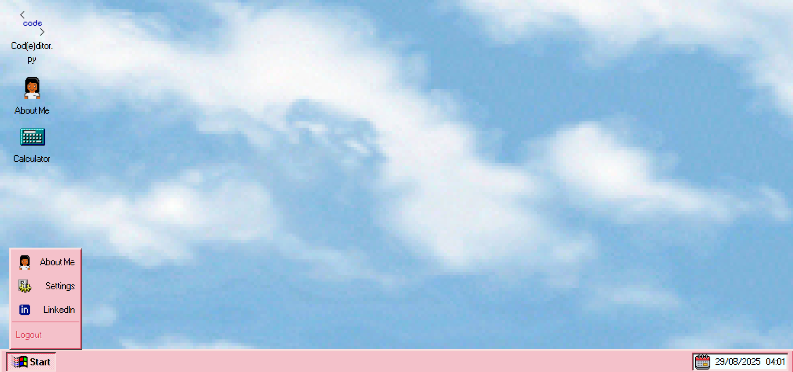
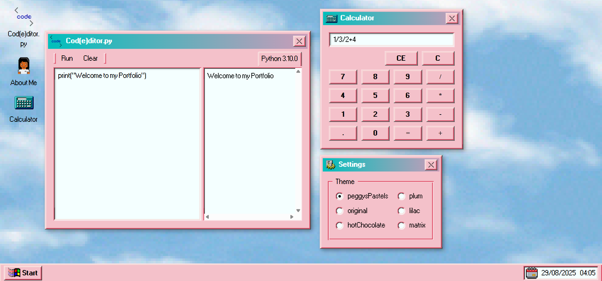

# 💾 Portfolio WebOS — Windows 95 Inspired Portfolio

A retro **Windows 95–style web desktop portfolio**, built with **React.js, Vite, and React95**.  
This project brings back the nostalgic desktop experience with apps like:

- 🖩 **Calculator**
- 👨‍💻 **Python Code Editor** (powered by [Piston API](https://github.com/engineer-man/piston))
- ⚙️ **Settings Menu** (switch themes)
- 🖱️ **Draggable Desktop Icons** (move apps around like the classic OS)

---

## 📸 Screenshots

---

## 🛠️ Tech Stack
- **[React.js](https://react.dev/)** (UI library)  
- **[Vite](https://vitejs.dev/)** (fast build tool)  
- **[React95](https://github.com/react95-io/React95)** (retro UI components)  
- **[Piston API](https://github.com/engineer-man/piston)** (for running Python code)  

---

## 🙌 Inspiration
This project was inspired by [Y2KOS](https://codingkatty.github.io/y2kos/) —  
a retro web desktop experience that captures the nostalgia of classic operating systems.  
I wanted to recreate a similar vibe with a Windows 95 look using **React95** and my own apps.
